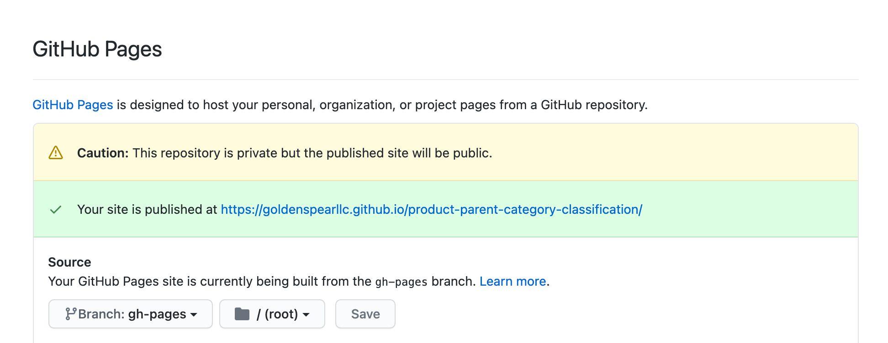

# Setup Mkdocs

In case you want to include a github page, follow the next instructions and keep the docs/ folder. 

Page: https://goldenspearllc.github.io/ce-template/

## Installation requirements
```
pip install mkdocs
pip install mkdocs-mermaid2-plugin
pip install mkdocs-material
pip install plantuml-markdown
pip install mkdocs-git-revision-date-localized-plugin
```

## Running

Inside the `docs/` folder run:
```
mkdocs gh-deploy
```

## Github repository

In the Settings menu of the github repository go to the Github section and configure it as:

